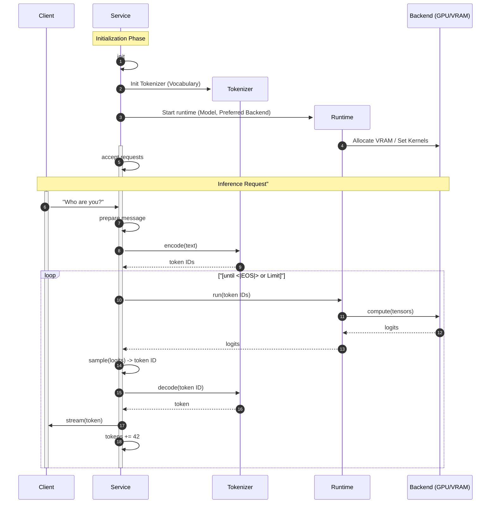
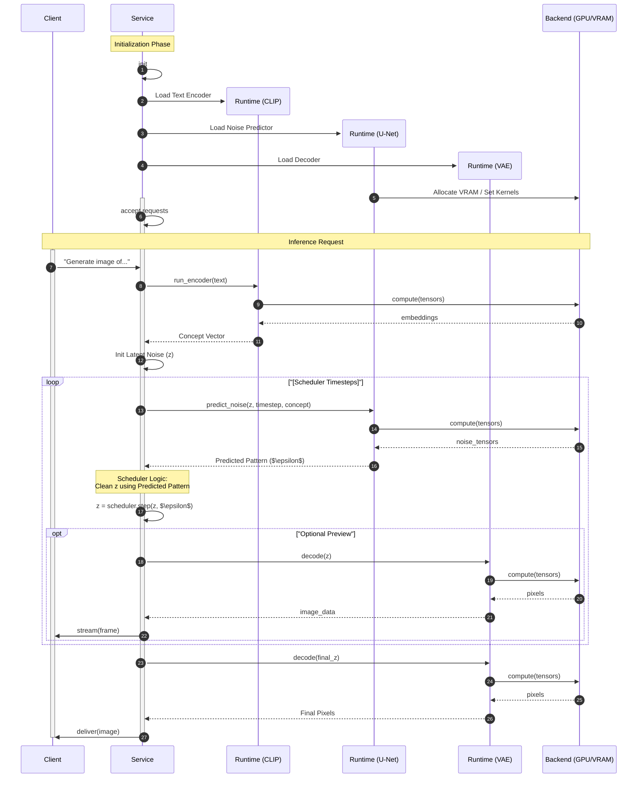
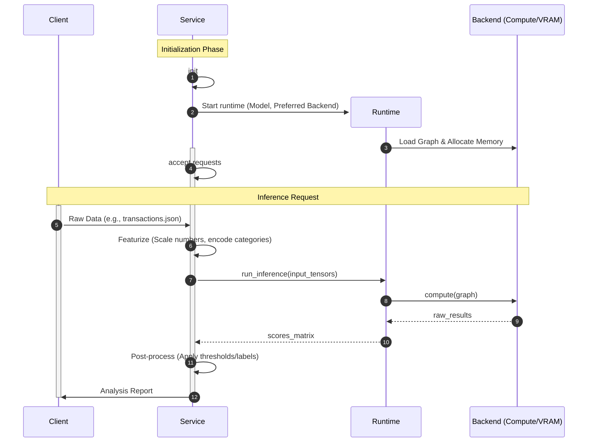

What we learned from "[AI/ML Models Are Not Libraries](/blog/2026/03/AI-ML-Models-Are-Not-Libraries)" is that models are essentially collections of numbers _(weights)_ and, optionally, mathematical formulas. The "optionally" part is key, as we saw in "[A Trip in the AI/ML Model Formats Jungle](/blog/2026/03/A-Trip-in-the-AI-ML-Model-Formats-Jungle)" that not all model files store the formulas themselves. Some formats are "Mostly Self-Confined," while others are "Weights-Only," expecting the application using them to "know" the underlying math. In "[Anatomy of a Model - the Developer Perspective](/blog/2026/03/Anatomy-of-a-Model-the-Developer-Perspective)", we explored different architectures and their inputs and outputs. With that groundwork laid, we can now consider the inference process as a whole.

By now, it should be clear that producing a meaningful _(to the caller)_ output during inference is a combined effort between the model, the inference runtime, and the inference endpoint that provides access to it.

## Inference Components

As with everything in software and IT, different people may interpret a term slightly differently when they use it. Here's what I mean by the terms you'll see later in this post.

### Compute Backend

Those large and complex computation graphs often demand massive processing power and substantial amounts of fast memory. This naturally leads to the need for specialized hardware. A compute backend is the engine that executes the graph on a specific device (e.g., GPU, TPU, CPU). It implicitly includes the device’s own memory (GPU VRAM, TPU memory, etc.), as that’s where the tensors reside during execution. Below are some examples of popular compute backends.

| **Compute Backend** | **Target Hardware**      | **Primary Software Layer**            |
| ------------------- | ------------------------ | ------------------------------------- |
| **CPU**             | x86 / ARM Processors     | Standard System RAM + OS Scheduler    |
| **CUDA**            | NVIDIA GPUs              | CUDA Cores + cuDNN + VRAM             |
| **MLX**             | Apple Silicon (M-series) | Unified Memory Architecture + Metal   |
| **OpenVINO**        | Intel CPUs/IGPUs/VPUs    | OneDNN / OpenCL / Plugin Architecture |
| **ROCm**            | AMD GPUs                 | HIP / ROCm Kernel Drivers             |
| **TPU (XLA)**       | Google TPU               | XLA Compiler + libtpu + PJRT          |

### Inference Runtime / Engine

It's a specialized execution engine designed to run models in a production environment. It serves as the bridge between the high-level mathematical abstractions of a neural network and the underlying compute backend. Its responsibility is to load the model's weights into the backend's memory and then perform computations using that backend on new input. Here are some popular runtimes.

| **Inference Runtime** | **Primary Target**                        | **Compatible Compute Backends**                         | **Programming Languages**                     |
| --------------------- | ----------------------------------------- | ------------------------------------------------------- | --------------------------------------------- |
| **ONNX Runtime**      | Cross-platform / Generic                  | CPU, CUDA, TensorRT, OpenVINO, CoreML, DirectML, ROCm   | Python, C++, C#, Java, JS/Node, Rust, Go      |
| **TensorRT**          | NVIDIA GPUs                               | CUDA, DLA (Deep Learning Accelerator)                   | Python, C++                                   |
| **OpenVINO**          | Intel Hardware                            | Intel CPU, iGPU, NPU, FPGA                              | Python, C++, C                                |
| **ExecuTorch**        | Mobile & Edge                             | CPU (XNNPACK), CoreML (iOS), MPS (Mac), Vulkan, NPU     | Python (Export), C++ (Runtime)                |
| **LiteRT (TFLite)**   | Mobile & Web                              | CPU, GPU (OpenCL/Metal), TPU (Edge), WebGPU             | Python, Java, Swift, C++, JS/TS               |
| **vLLM**              | Data Center LLMs                          | CUDA (NVIDIA), ROCm (AMD), TPU, OpenVINO (Intel)        | Python (Primary), C++                         |
| **llama.cpp**         | Zero Dependencies. Run anywhere with C++. | CPU (AVX/AMX), CUDA, Metal, Vulkan, SYCL, ROCm/HIP, RPC | C++, Python (via bindings), Go, Rust, Node.js |

::note{variant='soft'}  
Not every inference runtime can run every model. For example, `llama.cpp` is designed specifically for `GGUF`-formatted models.
::

### Inference Service

Inference runtimes work with numeric tensors. An inference service bridges the gap between them and the client's data. It's where the preparation for ingestion and the postprocessing of the model's result happen. Those can be modules within larger applications, libraries, standalone applications, web services, and so on.

### Inference Provider

Not really part of what this post is about, but oftentimes these are also called "Inference Runtimes" _(heck, I've used that mental shortcut with my clients)_. A provider is all of the above delivered as a managed service. Often called "Inference-as-a-Service".

- **The Cloud Giants** Google Vertex AI, AWS Bedrock, Azure AI provide the full menu: endpoints, enterprise security, and access to specialized backends (like TPUs or Inferentia)
- **Specialized API Providers** like Together AI, Fireworks.ai, DeepInfra focus on "Software-Defined Inference." They often write their own custom kernels and scheduling logic to be faster than the generic cloud providers.
- **Hardware-First Providers** like Groq, Cerebras, SambaNova are the ones that blur the lines most. They often market their entire cloud as a "Language Runtime" to emphasize that the hardware and software are one single, optimized unit.

## Inference Loops

Most generative models (including LLMs) are designed to be called in a loop. It's the inference service that controls when the generation ends.

### LLM Inference

A sequence diagram is probably the best way to visualize how all the inference components work together. Here is a conceptual LLM inference flow.



Keep in mind this describes a conceptual flow. It completely ignores aspects like performance, scalability, security, deployment architectures, and so on. In actual production systems, especially those under heavy load, we can't ignore those, and so the diagram would be somewhat different then. But these simplifications help illustrate the process.

#### Startup / Initialization Phase

1. The service typically starts by examining the configuration and the environment. It needs to determine:

- Which model(s) to use and how to access the artifact(s)? The model files could be bundled or downloaded on demand.
- What inference runtime(s) can load the model(s)?
- Which compute backend is best suited for the available hardware?
- Which tokenizer does the model use? Generally, this information should be provided by the model creators, either in a configuration file or apparent from the distribution artifact.

2. The service loads the tokenizer. Internally, LLMs use token IDs, and the tokenizer parses the input text and converts it to those IDs. The tokenizer's vocabulary is typically provided with the model, often in the form of a JSON file mapping each known word (or word fragment) to a number. Most inference runtimes include libraries that allow instantiating a tokenizer from these files.
3. The service starts the inference runtime, providing the model artifact or its location, along with the preferred compute backend(s).
4. The inference runtime instantiates a computation graph as defined by the model and loads the model's weights into the selected compute backend's memory. It then waits for the service to initiate a computation process.
5. The service exposes a UI or API to receive inference requests from clients.

#### Inference Request Processing

6. The service receives a request. The payload is a string.
7. The service performs standard checks to ensure the request should be processed (authentication, rate‑limit, quotas, etc.). It may also enhance/change the message according to some policy _(spellcheck, anonymization, ...)_.
8. The service calls the tokenizer to convert the content into token IDs. It's crucial that the service uses the exact same tokenizer and vocabulary as the one the model used during training.
9. The service gets a vector of token IDs from the tokenizer
10. The service requests to start a computation session on the currently loaded inference runtime, passing the vector of token IDs.
11. The inference runtime executes the computation graph loaded from the model on the specialized hardware through the compute backend.
12. LLMs are typically "[Decoder-Only Transformers](/blog/2026/03/Anatomy-of-a-Model-the-Developer-Perspective#decoder-only)" and their head produces logits.
13. The inference runtime returns to the service the logits.
14. The service selects the next token based on the logits returned. Typically, it first applies a `softmax` function to convert them to probabilities (decimal values between 0 and 1). Then it reduces the list to just a few token IDs using "top-p" (the smallest set of tokens whose cumulated probability is `p`) or "top-k" (the `k` tokens with the highest probability). It then randomly draws a token from the reduced list.
15. Assuming it is a streaming service, it calls the tokenizer to de-tokenize the ID
16. The service gets the actual word/fragment from the tokenizer.
17. The service sends the actual word/fragment back to the client.
18. If the selected token is the model’s `<|EOS|>` (End-Of-Sequence) token, then the service completes the session with the client. Otherwise, it appends the newly obtained token ID to the current vector of token IDs and repeats the process from step 10.

### Latent Diffusion Inference

Another example of models relying on loops for generations is diffusion models, frequently used for image generation.

Conceptually, those are not a single one but a combination of models. Typically, a `CLIP` model is used for understanding the textual input, a `U-Net` one for calculating the noise reduction, and a `VAE` for decoding the tensor into pixels.

Starting with a 100% noise, the service needs to invoke the inference runtime in a loop until a final result is achieved. This might be after a predefined number of iterations, or based on an algorithm that checks if the noise level falls below a certain threshold. This results in a rather complex flow:



Again, this is a conceptual flow. In production environments, the flow would be heavily optimized and thus look different. Still, fundamentally, this is what happens behind the scenes:

#### Startup / Initialization Phase

1. The service initializes by identifying the specific diffusion model configuration, the required runtimes, and the optimal hardware backends available.
2. The service instantiates the first inference runtime to load the text encoder (CLIP), which is responsible for understanding the semantic meaning of the user's prompt.
3. The service instantiates a second runtime for the noise predictor (U-Net), the "brain" of the diffusion process that identifies patterns within random noise.
4. The service instantiates a third runtime for the decoder (VAE), which is used to translate mathematical representations (latents) into actual pixel maps.
5. The runtimes coordinate with the compute backend to allocate VRAM and prepare the specialized kernels needed for high-speed tensor math.
6. With all models loaded and the hardware prepared, the service opens its API or UI to begin accepting image generation requests from clients.

#### Inference Request Processing

7. The service receives a natural language prompt from the client describing the image to be generated.
8. The service sends the prompt to the CLIP runtime to translate the string into a high-dimensional numerical representation (embeddings).
9. The CLIP runtime utilizes the backend to process the text, resulting in a "Concept Vector" that the other models can understand.
10. The result is a vector, which now acts as the permanent semantic anchor for the entire generation process.
11. The service receives this vector from the runtime
12. The service generates a tensor of completely random Gaussian noise (latents) at a smaller scale than the final image to serve as the "starting canvas."
13. The service starts the loop by passing the current noisy latents, the concept vector, and the current timestep to the U-Net runtime.
14. The U-Net runtime executes its graph on the backend to identify which parts of the current noise look like the requested concepts.
15. The execution results in a "pattern map" (predicted noise) representing the elements the model suggests should be removed to reveal the image.
16. The runtime passes this prediction back to the service for the next orchestration step.
17. The service uses the scheduler library to mathematically subtract a portion of the predicted noise from the current latents, resulting in a slightly "cleaner" version of the image.
18. If configured for streaming, the service sends the current intermediate latents to the VAE runtime for decoding.
19. The VAE runtime processes the mathematical latent on the backend to reconstruct a human-readable pixel map.
20. The runtime returns the raw image data (RGB pixels) to the service.
21. The service receives the frame and formats it for transmission.
22. The service pushes the low-quality preview frame to the client so the user can watch the image "emerge" from the noise.
23. Once the loop reaches the noise threshold or step limit, the service sends the final refined latent to the VAE runtime for high-quality reconstruction.
24. The VAE performs a final pass on the backend
25. The runtime execution results in the final pixel map
26. The service receives the final generated asset from the runtime.
27. The service performs any final post-processing (like PNG encoding) and delivers the completed image to the client, closing the session.

## Single‑Shot Inference

While the above flows relay on inference loops, many smaller models can get their work don using a single‑shot inference. That means we don't have to do the above mentioned predict-next loop and get the results we need by calling the inference runtime just once.

Consider the following categories of models:

- **Classification** – “which class does this belong to?”
- **Regression** – “what is the numerical value?”
- **Ranking/Recommendation** – “rank these items from most to least relevant.”
- **Similarity / Retrieval** – “which items are most similar?”
- **Detection / Segmentation** – “where are the objects? / what is the mask?”
- **Forecasting** – “what will the next value be?”
- **Anomaly** – “is this point an outlier?”

The steps to use any of those from our code are almost identical. At the initialization phase, we still need to pick a model, an inference runtime that can load it, potentially a compatible tokenizer, and a compute backend. At request processing time, we still need to preprocess the input, execute the computation, and postprocess the result. As not all models work with text and word tokenizers, let's see how other examples follow the same process.

Say we have a `json` with some credit card transactions and want to check for possible fraud. Our input could be a `json` like the one below.

```json
[
  {
    "account_id": "ACC_STEADY_COFFEE",
    "history": [
      {"month": 11, "day": 1, "dow": 1, "hour": 8, "min": 15, "amount": 4.50, ...},
      {"month": 11, "day": 1, "dow": 1, "hour": 9, "min": 30, "amount": 12.00, ... },
      ...
 ]
  },
  ...
]
```

If we were to run a fraud detection model like [IBM's `GRU` or `LSTM` models](https://github.com/IBM/ai-on-z-fraud-detection), we need to convert our data to a feature tensor during the preprocessing. The input shape of the model is `[7, 16, 220]`, meaning it is designed to process 7 batches of data simultaneously, where each batch contains a sequence of 16 transactions, and each transaction is represented by 220 features. So that's what the service needs to produce.

```json
[
 [ // batch 1
  [f1, f2, ..., f220], // transaction 1
  ...
  [f1, f2, ..., f220], // transaction 16
 ],
 ...
 [ // batch 7
  ...
 ]
]
```

Then the service can execute the model just once and get the scores. The output shape of `[7, 16, 1]` means the model generates results for 7 batches simultaneously, where each batch contains a single fraud score for each of the 16 transactions in the sequence. During post-processing, the service converts those scores to meaningful thresholds or labels

Here is how the inference flow looks:



Hopefully, the flow is simple enough and self-explanatory, but for the sake of consistency with the previous ones:

#### Startup / Initialization Phase

1. The service prepares the environment and determines which model and backend are required for the task.
2. The service instantiates the inference runtime and provides the model artifact.
3. The runtime communicates with the compute backend to load the model's computation graph into memory and prepare for execution.
4. The service begins listening for data payloads from clients.

#### Inference Request Processing

5. The client sends a dataset, such as a collection of transaction histories.
6. The service performs the "data preparation" step, constructing a `[7, 16, 220]` tensor
7. The service passes the prepared tensors to the runtime.
8. The runtime executes the graph on the backend.
9. The backend produces the `[7, 16, 1]` tensor with the scores.
10. The runtime sends the scores tensor to the service.
11. The service applies the business logic to the raw scores, such as labeling a high-probability score as "FRAUD" or a medium one as "SUSPECT."
12. The service returns the final report or categorized data to the client.

## Summary

While AI models are often viewed as black boxes, their execution in production relies on a precise orchestration between specialized hardware, execution runtimes, and the services that wrap them. In the academic Python world, these boundaries are often blurred; a script that produces a correct result may not offer a clear path for decomposition or scaling.

It was only after reproducing these behaviors in language stacks like Java and TypeScript—using unified runtimes like ONNX—that I was able to establish a clear mental model of how these pieces fit together. This post deconstructs that connection, illustrating the interplay between **compute backends**, **inference runtimes**, and **services** to help you architect systems that are both performant and truly scalable.

---

::note{color='soft' title='AI for Application Developers Series' icon='mdi-light-book-multiple'}  
The post is part of the [AI for Application Developers](/blog/2026/03/AI-for-Application-Developers) series - my personal notes on various AI topics converted to blog posts.

Please do not hesitate to **correct** me if I got something wrong, **contribute** if something is missing, **ask** me to clarify or simply **share** your experience and views.  
::
